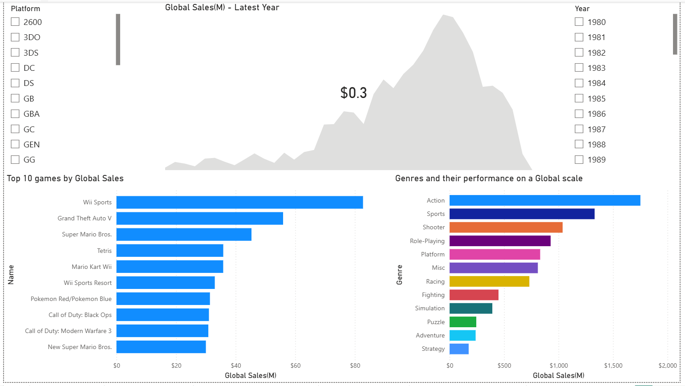
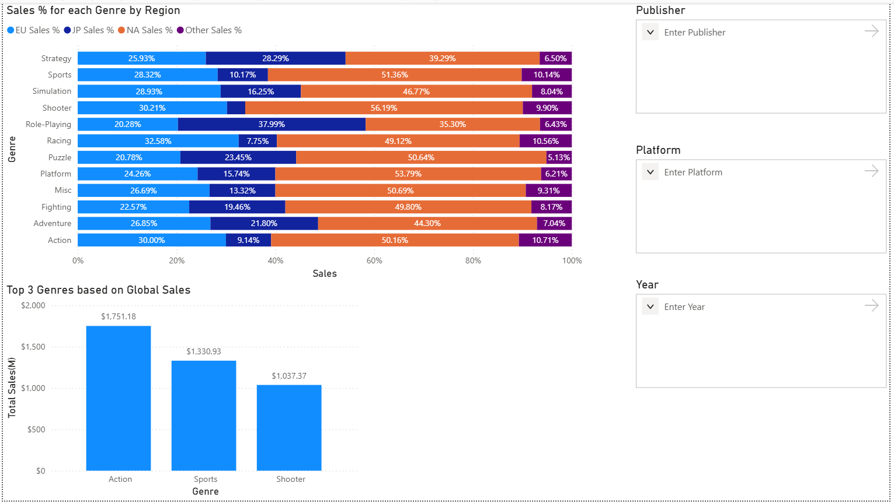
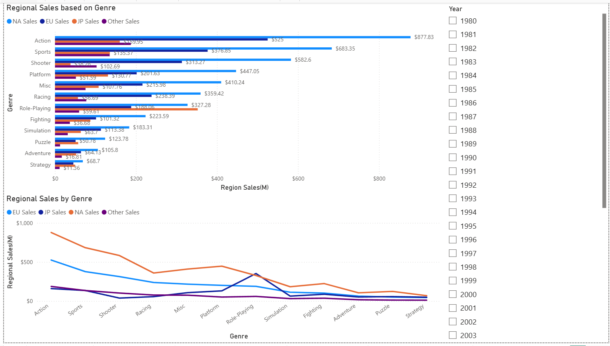
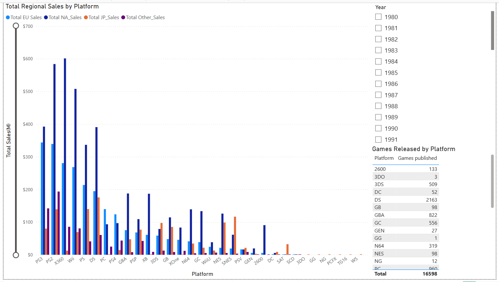
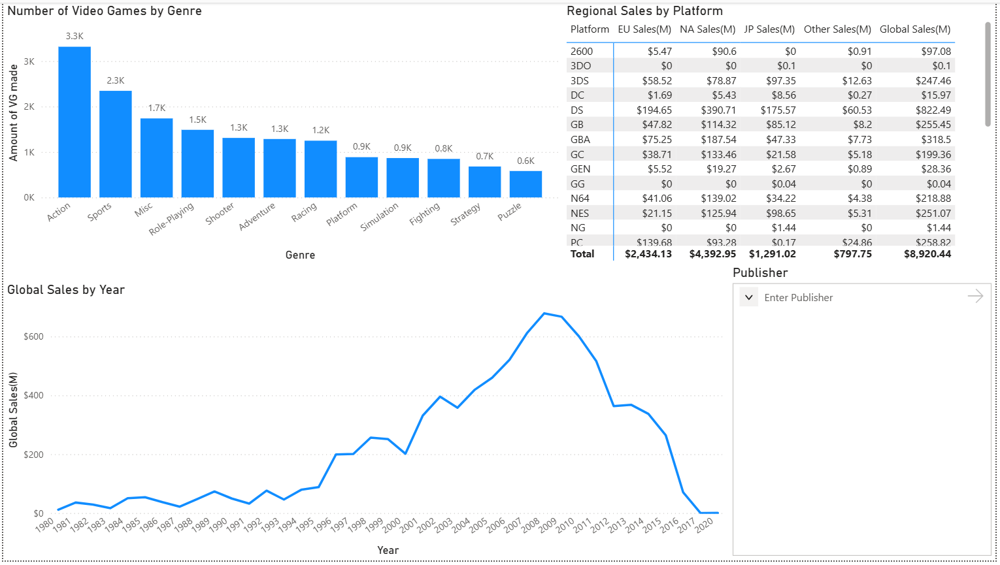
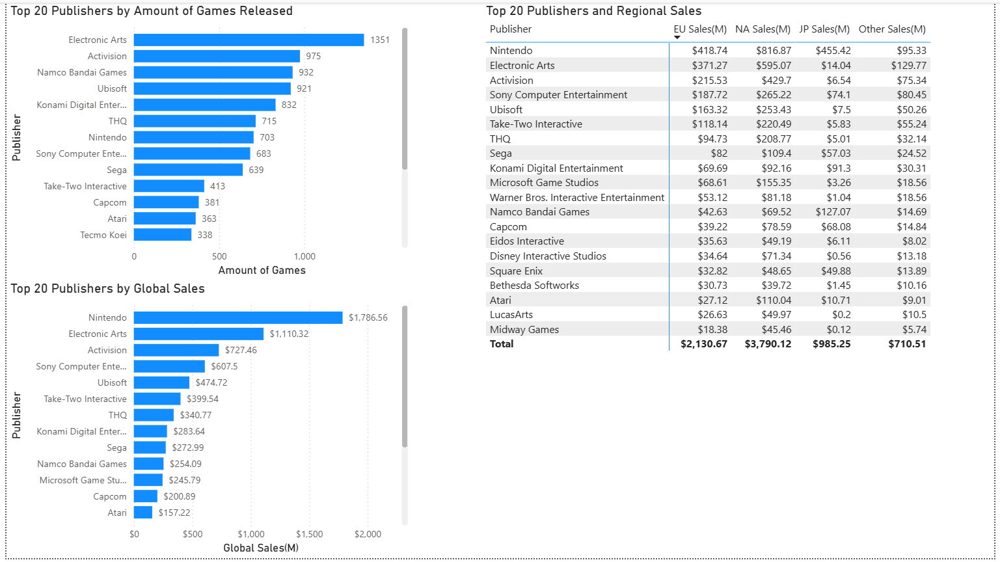
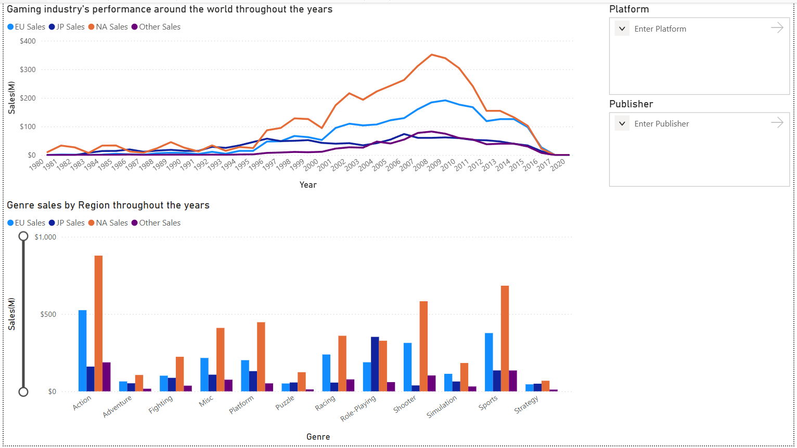

# Video Game Sales Analysis — Power BI Dashboard

## Overview

This project visualizes and explores global video game sales data using Power BI Desktop.
The goal is to answer business and market-related questions through interactive dashboards,
DAX measures, and multi-page report design.

The dashboard covers:
- Video game titles and their global performance
- Regional sales across North America, Europe, Japan, and other markets
- Genre trends and preferences by region
- Platform performance by sales and volume
- Publisher dominance by revenue and titles released
- Industry-wide sales trends from 1980 to 2020

---

## Dashboard Preview

### Global Sales - Latest Year


### Sales % for each Genre by Region


### Regional Sales based on Genre


### Total Regional Sales by Platform


### Detailed Global Sales by Genre


### Top 20 Publishers


### Gaming Industry throughout the years


---

## Objectives

This project aims to:
- Design a multi-page Power BI report with a clear analytical narrative
- Apply DAX to create calculated measures beyond raw column aggregations
- Use Power Query to handle data quality issues (mixed types, N/A values)
- Explore regional sales trends and identify market differences
- Identify top-performing games, genres, platforms, and publishers
- Practice report layout, visual selection, and interactivity design

---

## Pages & What They Show

| Page | Description |
|------|-------------|
| Global Sales - Latest Year | KPI headline with yearly trend, top 10 games by global sales, and genre performance |
| Sales % for each Genre by Region | 100% stacked bar showing regional share per genre using DAX % measures |
| Regional Sales based on Genre | Clustered bar and area chart comparing all four regions across genres |
| Total Regional Sales by Platform | Multi-region clustered bar across all platforms with games released reference table |
| Detailed Global Sales by Genre | Genre game counts, regional sales table by platform, and global sales by year line chart |
| Top 20 Publishers | Publisher rankings by volume and revenue with full regional breakdown table |
| Gaming Industry throughout the years | Multi-region line chart 1980–2020 and genre sales by region clustered bar |

---

## Business Questions Explored

- Which games generated the highest global sales?
- How do genre preferences differ between North America, Europe, and Japan?
- Which platforms produced the most revenue relative to titles released?
- Which publishers dominated by volume vs by revenue — and are they the same?
- How did the global games market evolve from 1980 to 2020?
- What share of global sales does each region account for per genre?

---

## Power BI Concepts Used

- KPI visuals and Card visuals
- Clustered and stacked bar charts
- 100% stacked bar charts
- Line and area charts
- Matrix tables with totals
- Slicers (list, dropdown, and input types)
- TopN visual-level filters
- Cross-filtering between visuals
- DAX calculated measures
- Power Query custom columns
- Custom format strings for display units

---

## DAX Measures

```dax
EU Sales %    = DIVIDE(SUM(vgsales[EU_Sales]),    SUM(vgsales[Global_Sales]))
NA Sales %    = DIVIDE(SUM(vgsales[NA_Sales]),    SUM(vgsales[Global_Sales]))
JP Sales %    = DIVIDE(SUM(vgsales[JP_Sales]),    SUM(vgsales[Global_Sales]))
Other Sales % = DIVIDE(SUM(vgsales[Other_Sales]), SUM(vgsales[Global_Sales]))
```

`DIVIDE` is used instead of `/` to handle division by zero gracefully.

---

## Power Query

A custom helper column was added to sort the Year field correctly.
The raw dataset contains N/A values in the Year column which prevent
direct numeric sorting and cause incorrect chronological ordering in visuals.

```
YearSort = if [Year] = "N/A" then 9999 else Number.From([Year])
```

The Year column is sorted by YearSort, pushing N/A entries to the end
and preserving correct chronological order across all pages.

---

## Key Findings

- The global market **peaked in 2008–2009** driven by the Wii era, then declined steadily through 2020
- **North America** accounted for ~49% of all global sales across all genres
- **Action** was the top genre globally at $1,751M; **Role-Playing** dominated Japan, contrasting sharply with Western markets
- **Wii Sports** is the best-selling title at $82.74M globally
- **PS2** generated the highest platform sales at $1,255M
- Despite releasing fewer titles than Electronic Arts, **Nintendo** generated more revenue ($1,786M) than any other publisher
- **Japan** showed distinctly different genre preferences compared to North America and Europe across every genre
- **DS** had the highest number of individual titles released (2,163) of any platform in the dataset

---

## Dataset

- **Source:** [Kaggle — Video Game Sales](https://www.kaggle.com/datasets/gregorut/videogamesales)
- **File:** `vgsales.csv`
- **Rows:** 16,598 video game titles
- **Period:** 1980–2020
- **Columns:** Name, Platform, Year, Genre, Publisher, NA_Sales, EU_Sales, JP_Sales, Other_Sales, Global_Sales
- **Sales unit:** Millions of units sold

---

## How to Open

1. Download `dashboard/vgsales_dashboard.pbix`
2. Open with [Power BI Desktop](https://powerbi.microsoft.com/desktop/) (free)
3. If prompted about the data source, repoint it to `dataset/vgsales.csv`

---

## Tools Used

- Power BI Desktop
- DAX (Data Analysis Expressions)
- Power Query (M)
- GitHub

---

## Related Project

SQL analysis of the same dataset:
[vgsales-sql-analysis](https://github.com/panagiotisflrs/video-game-sales-analysis.git)
